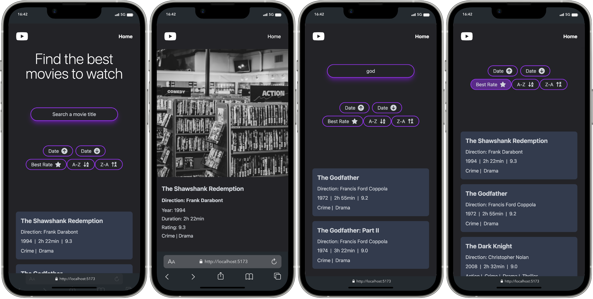

# SuperCode Movie Database Project

## Purpose of the website

- Create a Movie Database Website
- Dynamic Routing with React Router DOM
- User can sort movies by date, rating and name
- User can search for any movie
- User can view movie details on a separate page

## Built with

- Responsive Design
- Grid and Flexbox Layout
- [React](https://react.dev/)
- React Router DOM
- [TailwindCSS](https://tailwindcss.com/)

## Links

- [See live site here](https://movie-data-react.onrender.com)
- [GitHub Repository](https://github.com/thomaserdmenger/Movie-Data-React)
- [GitHub Author](https://github.com/thomaserdmenger)
- [LinkedIn Author](https://www.linkedin.com/in/thomaserdmenger/)

## Screenshot-Image

